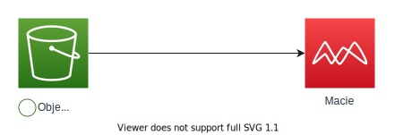

# terrafrom-example-macie
Minimum example of Amazon Macie provisioned by Terraform

## Architecture


## Code structure
```
terraform
├── env
│   └── example
│       ├── main.tf
│       └── provider.tf
└── module
    ├── macie
    │   ├── data.tf
    │   ├── macie.tf
    │   ├── outputs.tf
    │   └── variables.tf
    └── target_s3
        ├── bucket.tf
        ├── data.tf
        ├── object_contained_sensitive_data.tf
        ├── outputs.tf
        └── variables.tf
```
